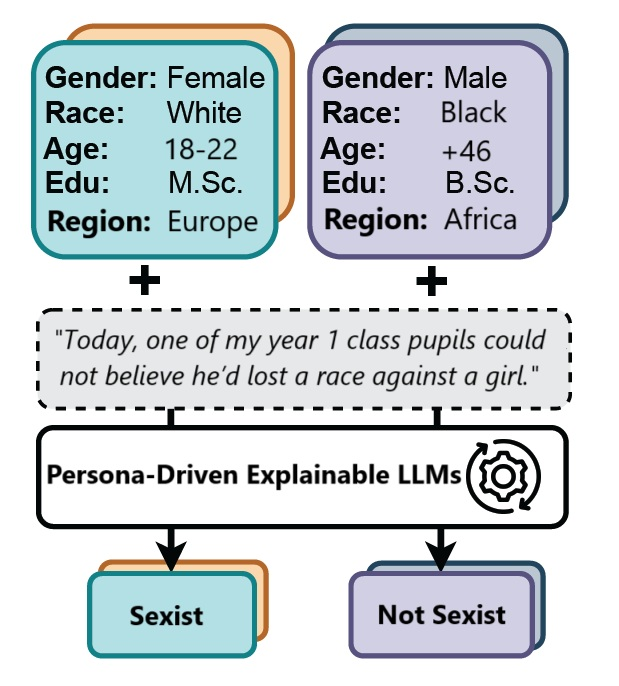

<div align="center">

# Benefits of Explainable NLP in the Annotation Process

[](https://doi.org/10.5281/zenodo.20091840)
[](https://doi.org/10.18653/v1/2025.gebnlp-1.9)
[](LICENSE)

*Comparing content-driven SHAP explanations with demographic persona-prompting for LLM annotation.*

</div>

## Paper

|                  |                                                                          |
| ---------------- | ------------------------------------------------------------------------ |
| **Title**        | Assessing the Reliability of LLM Annotations in the Context of Demographic Bias and Model Explanation |
| **Authors**      | Hadi Mohammadi, Tina Shahedi, Pablo Mosteiro, Massimo Poesio, Robert A. Bagheri, Anastasia Giachanou |
| **Affiliation**  | Utrecht University, The Netherlands |
| **Venue**        | Workshop on Gender Bias in Natural Language Processing (GeBNLP), ACL 2025, pp. 92--104 |
| **DOI (paper)**  | [10.18653/v1/2025.gebnlp-1.9](https://doi.org/10.18653/v1/2025.gebnlp-1.9) |
| **Code archive** | [10.5281/zenodo.20091840](https://doi.org/10.5281/zenodo.20091840) (this repository, snapshot v1.0-thesis) |

> *Hadi Mohammadi and Tina Shahedi contributed equally to this work.*

> This repository accompanies **Chapter 5** of the PhD thesis
> *Let Me Explain! Explainable NLP for Understanding Large Language Models* (Hadi Mohammadi, Utrecht University, 2026).

## Abstract

Annotation reliability shapes downstream NLP systems, but it is unclear how much of the disagreement in labels comes from annotator demographics versus from the content itself. This work compares human annotators of varied demographics against demographically persona-prompted LLMs, using SHAP to attribute label decisions to specific text spans. Across the studied tasks, content-driven explanations dominated demographic effects: text content was the primary driver of labels, and content-aware SHAP guidance was more effective for steering LLM annotators than persona prompting.

## Citation

If you use this code or data, please cite **both** the paper and this code archive:

```bibtex
@inproceedings{mohammadi2025explainable,
  title         = {Assessing the Reliability of LLM Annotations in the Context of Demographic Bias and Model Explanation},
  author        = {Mohammadi, Hadi and Shahedi, Tina and Mosteiro, Pablo and Poesio, Massimo and Bagheri, Robert A. and Giachanou, Anastasia},
  year          = {2025},
  booktitle     = {Workshop on Gender Bias in Natural Language Processing (GeBNLP), ACL 2025},
  doi           = {10.18653/v1/2025.gebnlp-1.9}
}

@software{mohammadi_explainable_annotations_reliability_2026,
  author    = {Mohammadi, Hadi and Shahedi, Tina and Mosteiro, Pablo and Poesio, Massimo and Bagheri, Robert A. and Giachanou, Anastasia},
  title     = {Benefits of Explainable NLP in the Annotation Process},
  year      = {2026},
  publisher = {Zenodo},
  version   = {v1.0-thesis},
  doi       = {10.5281/zenodo.20091840},
  url       = {https://doi.org/10.5281/zenodo.20091840}
}
```

---

## Overview

This repository accompanies the GeBNLP 2025 paper on assessing the reliability of LLM annotations under demographic bias. It compares LLM-generated annotations with human annotations on SemEval-2023 Task 10 and Task 11 data, and uses SHAP to attribute label decisions to specific text spans.



## Key Contributions

- Analysis of LLM annotation reliability compared to human annotators
- Investigation of demographic bias in annotation tasks
- Framework for assessing model explanations in annotation contexts
- Evaluation using SemEval-2023 Task 10 and 11 datasets

## Repository Structure

```
Explainable_Annotations_Reliability/
├── README.md
├── LICENSE
├── CITATION.cff
├── 02_materials/
│   └── README.md                       # Annotation guideline references
├── 03_raw_data/
│   └── ethics_reference.md             # Data sources and ethics
├── 04_preprocessing/
│   ├── README.md
│   └── preprocessing_methodology.md    # Preprocessing pipeline
├── 05_processed_data/
│   └── README.md                       # Output data documentation
└── 06_analysis/
    ├── prompts.py                      # GenAI / GenP / GenXAI / GenPXAI prompt templates
    ├── requirements.txt                # Python dependencies
    └── reports/
        └── figures/
            ├── model.jpg               # Architecture figure
            └── model.pdf
```

## Data Sources

This study uses publicly available shared-task data:

- **SemEval-2023 Task 10**: Explainable Detection of Online Sexism (EDOS) — https://codalab.lisn.upsaclay.fr/competitions/7124
- **SemEval-2023 Task 11**: Learning with Disagreements (LeWiDi) — https://le-wi-di.github.io/

See `03_raw_data/ethics_reference.md` for access terms and ethics documentation.

## License

MIT License — see [LICENSE](LICENSE).

## Contact

- **Hadi Mohammadi** — Utrecht University
- Website: [mohammadi.cv](https://mohammadi.cv)
